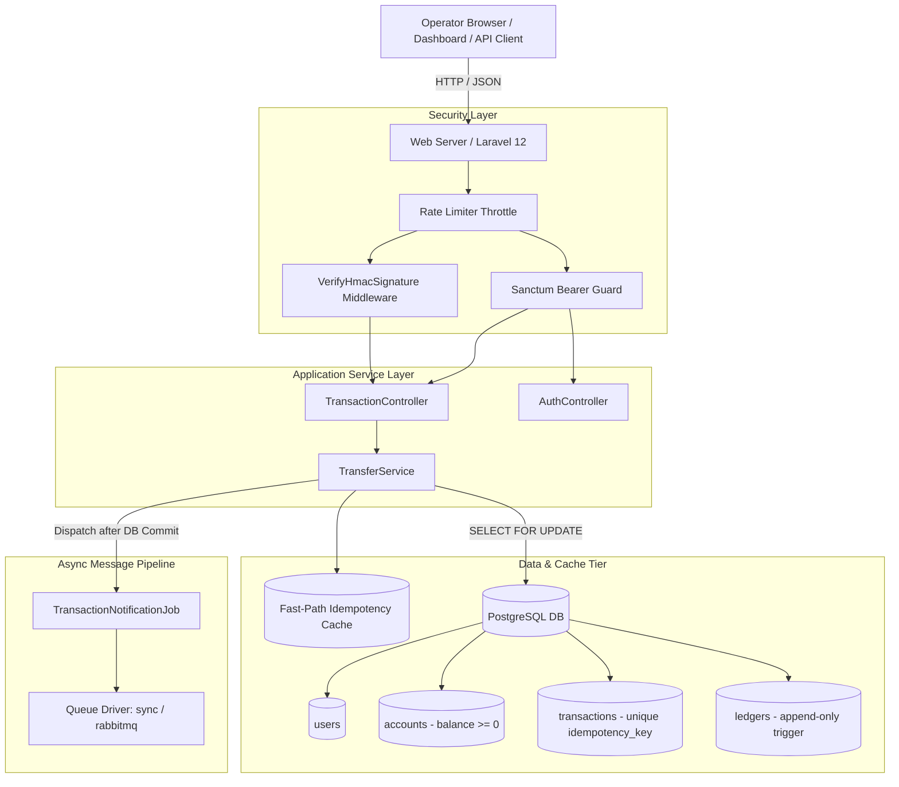

# SentinelPay 2.0 — Comprehensive Project & Technical Documentation

> **Status**: Verified Production-Grade Specification  
> **Backend**: Laravel 12 (PHP 8.2+) · PostgreSQL (ACID & Append-Only Trigger Enforced)  
> **Security**: HMAC-SHA256 Request Signing · Laravel Sanctum API Tokens · Aggressive Rate-Limiting  
> **Frontend**: Dark Liquid Glass Fintech Dashboard (Vanilla ES Module Engine + Tailwind CSS + Vite)  
> **Branch**: `feat/phase-1-transaction-correctness`  
> **Verified Test Proof**: 47 Passing Automated Tests (162 Assertions) · 0 Regressions

---

## 1. System Architecture & High-Level Design

SentinelPay is an institutional, high-availability payment processing engine designed to guarantee financial integrity, zero race-condition overdrafts, and tamper-proof audit trails.

### High-Level Architecture Diagram



### Architectural Principles & Boundaries

1. **Authoritative Backend**: The Laravel 12 application is the sole authority executing financial logic and database mutations.
2. **Strict Separation of Privileges**:
   - **Machine-to-Machine / Transfer Execution**: Enforced via cryptographic HMAC-SHA256 signature verification (`X-Signature` header).
   - **User Session & Account Introspection**: Enforced via Laravel Sanctum Bearer tokens scoped strictly to authenticated users. Horizontal privilege escalation is blocked at controller boundaries.
3. **No Direct Database Exposure**: Neither the frontend UI nor external clients ever communicate directly with the database or Supabase credentials.

---

## 2. Financial Invariants & Concurrency Engine

The core invariant of SentinelPay is: **Money is never created, lost, or duplicated, and accounts can never overdraw or enter inconsistent states.**

### Core Invariants

1. **Balance Conservation**: In any transfer of amount $X$, the sender balance decreases by exactly $X$, the receiver balance increases by exactly $X$, and two immutable ledger records (1 Debit, 1 Credit) are persisted. The total money in the system remains constant.
2. **Non-Negative Balances**: Account balances must satisfy `balance >= 0.00` at all times.
3. **Strict Idempotency**: Submitting a transfer request multiple times with the same idempotency key executes the financial debit/credit exactly once. Subsequent requests return the original transaction record without re-execution.
4. **Payload Mismatch Conflict**: Submitting an existing idempotency key with modified financial parameters (altered amount, currency, sender, or receiver) is strictly rejected with `HTTP 409 Conflict`.
5. **Atomic Rollback**: If any failure occurs during transfer execution (e.g. database error, mid-transaction exception), the entire database transaction is rolled back, leaving zero balance changes, zero ledger rows, and zero dangling transaction records.

### Deadlock-Free Pessimistic Row Locking

To prevent race conditions and concurrent overdrafts, `TransferService::transfer` utilizes PostgreSQL pessimistic row-level locking (`SELECT ... FOR UPDATE`).

To eliminate deadlocks caused by concurrent bidirectional transfers (e.g., Alice sending to Bob while Bob simultaneously sends to Alice), account UUIDs are sorted in memory before acquiring locks:

```php
// app/Services/TransferService.php
$lockIds = [$senderAccountId, $receiverAccountId];
sort($lockIds);

$accounts = Account::whereIn("id", $lockIds)
    ->lockForUpdate()
    ->get()
    ->keyBy("id");
```

### Immutable Append-Only Ledger

The `ledgers` table stores the single source of truth for all historical balances. Mutations and deletions are strictly forbidden at two independent layers:
1. **Application Layer (`app/Models/Ledger.php`)**:
   ```php
   public function update(array $attributes = [], array $options = []): bool
   {
       throw new \RuntimeException('Ledger is append-only. Updates are not permitted.');
   }
   public function delete(): ?bool
   {
       throw new \RuntimeException('Ledger is append-only. Deletes are not permitted.');
   }
   ```
2. **Database Trigger Layer (`database/migrations/2024_01_01_000004_create_ledgers_table.php`)**:
   ```sql
   CREATE OR REPLACE FUNCTION prevent_ledger_mutation()
   RETURNS TRIGGER AS $$
   BEGIN
       RAISE EXCEPTION 'Ledger is append-only. UPDATE and DELETE operations are not permitted.';
   END;
   $$ LANGUAGE plpgsql;

   CREATE TRIGGER ledger_no_update BEFORE UPDATE ON ledgers FOR EACH ROW EXECUTE FUNCTION prevent_ledger_mutation();
   CREATE TRIGGER ledger_no_delete BEFORE DELETE ON ledgers FOR EACH ROW EXECUTE FUNCTION prevent_ledger_mutation();
   ```

---

## 3. Cryptography & Security Controls

### HMAC-SHA256 Request Signing

All mutating transfer requests (`POST /api/v1/transfers`) require an `X-Signature` HTTP header.

- **Algorithm**: `HMAC-SHA256` computed over the exact raw HTTP request body using the shared secret (`HMAC_SECRET`).
- **Timing-Attack Protection**: The middleware (`app/Http/Middleware/VerifyHmacSignature.php`) uses `hash_equals()` for constant-time comparison:
  ```php
  $expected = hash_hmac('sha256', $rawBody, $secret);
  if (! hash_equals($expected, $signature)) {
      return response()->json([
          'error' => 'Invalid signature.',
          'message' => 'The X-Signature header does not match the request payload.',
      ], 403);
  }
  ```

### Canonical Payload Fingerprinting

To detect idempotency key tampering or conflicting payload re-use, `TransferService::calculatePayloadFingerprint` calculates a canonical SHA-256 hash:

1. **Amount Normalization**: Amount string normalized to 2 decimal places using `bcadd($amount, '0', 2)`.
2. **Currency Normalization**: Uppercase and trimmed.
3. **Deterministic Key Ordering**: Payload keys sorted alphabetically (`ksort`).
4. **Fingerprint Computation**:
   ```php
   $payload = [
       "amount" => bcadd($amount, "0", 2),
       "currency" => strtoupper(trim($currency)),
       "receiver_id" => $receiverAccountId,
       "sender_id" => $senderAccountId,
   ];
   ksort($payload);
   $canonicalString = json_encode($payload, JSON_THROW_ON_ERROR);
   return hash("sha256", $canonicalString);
   ```
If an incoming request reuses an `idempotency_key` but provides a different `payload_hash`, the system throws `IdempotencyConflictException` and returns `HTTP 409 Conflict`.

### TOCTOU (Time-of-Check to Time-of-Use) Race Resolution

If two identical requests arrive simultaneously and both miss the fast-path cache before either has committed, both enter `DB::transaction`. PostgreSQL's `UNIQUE (idempotency_key)` constraint permits exactly one to commit. The second request raises `UniqueConstraintViolationException`. Instead of crashing with a 500 error, `TransferService` catches this exception, verifies the payload fingerprint of the committed winner, warms the cache, and returns the committed transaction.

### Authentication & Token Security

- **Laravel Sanctum Bearer Tokens**: Configured with UUID morph support (`uuidMorphs('tokenable')`) to align with UUID primary keys on `users`.
- **Token Invalidation**: `POST /api/v1/auth/logout` explicitly deletes the current access token. Revoked tokens are immediately rejected by `auth:sanctum`.
- **Horizontal Access Boundary**: `TransactionController` verifies that `$account->user_id === $request->user()->id`. Attempting to query or transfer from an account owned by another user yields `403 Forbidden`.

### Rate Limiting Policies (`routes/api.php`)

| Route | Method | Rate Limit | Protection Objective |
|---|---|---|---|
| `/api/v1/auth/login` | `POST` | 5 req / min | Brute-force & credential stuffing defense |
| `/api/v1/auth/logout` | `POST` | 60 req / min | Token cleanup throttling |
| `/api/v1/transfers` | `POST` | 30 req / min | Abuse, flooding & wallet draining prevention |
| `/api/v1/accounts` | `GET` | 60 req / min | Account enumeration throttling |
| `/api/v1/accounts/{id}/balance` | `GET` | 60 req / min | Polling defense |
| `/api/v1/accounts/{id}/transactions` | `GET` | 60 req / min | Query volume defense |
| `/api/v1/health` | `GET` | 120 req / min | Monitoring and heartbeat probe allowance |

---

## 4. PostgreSQL Database Schema

### Table: `users`
| Column | Type | Constraints / Attributes |
|---|---|---|
| `id` | `UUID` | Primary Key |
| `name` | `VARCHAR(255)` | Not Null |
| `email` | `VARCHAR(255)` | Unique, Index |
| `email_verified_at`| `TIMESTAMP` | Nullable |
| `password` | `VARCHAR(255)` | Hashed |
| `remember_token` | `VARCHAR(100)` | Nullable |
| `created_at`, `updated_at` | `TIMESTAMP` | Standard timestamps |

### Table: `accounts`
| Column | Type | Constraints / Attributes |
|---|---|---|
| `id` | `UUID` | Primary Key |
| `user_id` | `UUID` | Foreign Key $\rightarrow$ `users.id` (RESTRICT), Index |
| `balance` | `DECIMAL(20, 2)` | Default: `0.00`, Constraint: `accounts_balance_non_negative CHECK (balance >= 0)` |
| `currency` | `VARCHAR(3)` | Default: `USD` |
| `is_active` | `BOOLEAN` | Default: `true` |
| `created_at`, `updated_at` | `TIMESTAMP` | Standard timestamps |

### Table: `transactions`
| Column | Type | Constraints / Attributes |
|---|---|---|
| `id` | `UUID` | Primary Key |
| `idempotency_key` | `VARCHAR(128)` | Unique Index |
| `payload_hash` | `VARCHAR(64)` | Nullable, SHA-256 canonical hash |
| `sender_id` | `UUID` | Foreign Key $\rightarrow$ `accounts.id` (RESTRICT), Index |
| `receiver_id` | `UUID` | Foreign Key $\rightarrow$ `accounts.id` (RESTRICT), Index |
| `amount` | `DECIMAL(20, 2)` | Constraint: `transactions_amount_positive CHECK (amount > 0)` |
| `status` | `ENUM` | `['pending', 'processing', 'completed', 'failed', 'reversed']` |
| `currency` | `VARCHAR(3)` | Default: `USD` |
| `signature` | `TEXT` | Request HMAC signature |
| `failure_reason` | `TEXT` | Nullable failure notes |
| `created_at`, `updated_at` | `TIMESTAMP` | Standard timestamps |

### Table: `ledgers` (Immutable / Append-Only)
| Column | Type | Constraints / Attributes |
|---|---|---|
| `id` | `BIGINT` | Primary Key (BigIncrements) |
| `account_id` | `UUID` | Foreign Key $\rightarrow$ `accounts.id` (RESTRICT), Index |
| `transaction_id` | `UUID` | Foreign Key $\rightarrow$ `transactions.id` (RESTRICT), Index |
| `type` | `ENUM` | `['debit', 'credit']` |
| `amount` | `DECIMAL(20, 2)` | Constraint: `ledgers_amount_positive CHECK (amount > 0)` |
| `balance_after` | `DECIMAL(20, 2)` | Constraint: `ledgers_balance_after_non_negative CHECK (balance_after >= 0)` |
| `created_at`, `updated_at` | `TIMESTAMP` | Standard timestamps |
| **Triggers** | — | `ledger_no_update`, `ledger_no_delete` execute `prevent_ledger_mutation()` |

### Table: `personal_access_tokens`
| Column | Type | Constraints / Attributes |
|---|---|---|
| `id` | `BIGINT` | Primary Key |
| `tokenable_type`, `tokenable_id` | `VARCHAR(255)`, `UUID` | Configured via `$table->uuidMorphs('tokenable')` |
| `name` | `VARCHAR(255)` | Not Null |
| `token` | `VARCHAR(64)` | Unique Index (SHA-256 hashed) |
| `abilities` | `TEXT` | Nullable |
| `last_used_at`, `expires_at` | `TIMESTAMP` | Nullable |
| `created_at`, `updated_at` | `TIMESTAMP` | Standard timestamps |

---

## 5. Complete REST API Specification

### Base URL
All API endpoints are prefixed with `/api/v1`.

---

### Endpoint: Health Check
Retrieves the service health status and server timestamp.
- **Route**: `GET /api/v1/health`
- **Auth**: None (Public)
- **Rate Limit**: 120 requests/minute
- **Response `200 OK`**:
  ```json
  {
    "status": "ok",
    "service": "SentinelPay",
    "timestamp": "2026-09-22T17:31:35+00:00"
  }
  ```

---

### Endpoint: User Login
Exchanges valid user credentials for a Sanctum Bearer token and returns owned accounts.
- **Route**: `POST /api/v1/auth/login`
- **Auth**: None (Public)
- **Rate Limit**: 5 requests/minute
- **Request Body**:
  ```json
  {
    "email": "operator@sentinelpay.io",
    "password": "Password123!"
  }
  ```
- **Response `200 OK`**:
  ```json
  {
    "status": "success",
    "message": "Authenticated successfully.",
    "data": {
      "token": "1|qX8z9...plainTextToken",
      "token_type": "Bearer",
      "user": {
        "id": "9a3b2184-...",
        "name": "Operator Demo",
        "email": "operator@sentinelpay.io",
        "accounts": [
          {
            "id": "01a0c9f0-...",
            "balance": "10000.00",
            "currency": "USD",
            "is_active": true
          }
        ]
      }
    }
  }
  ```
- **Error Responses**:
  - `401 Unauthorized`: Invalid credentials.
  - `422 Unprocessable Entity`: Validation failure on email or password.

---

### Endpoint: User Logout
Revokes the current Sanctum Bearer token.
- **Route**: `POST /api/v1/auth/logout`
- **Auth**: `Authorization: Bearer <sanctum_token>`
- **Rate Limit**: 60 requests/minute
- **Response `200 OK`**:
  ```json
  {
    "status": "success",
    "message": "Token revoked. You have been logged out."
  }
  ```
- **Error Response**:
  - `401 Unauthorized`: Missing or invalid token.

---

### Endpoint: List User Accounts
Returns all accounts owned by the authenticated user.
- **Route**: `GET /api/v1/accounts`
- **Auth**: `Authorization: Bearer <sanctum_token>`
- **Rate Limit**: 60 requests/minute
- **Response `200 OK`**:
  ```json
  {
    "status": "success",
    "data": [
      {
        "id": "01a0c9f0-...",
        "balance": "10000.00",
        "currency": "USD",
        "is_active": true,
        "created_at": "2026-09-22T00:00:00.000000Z"
      }
    ]
  }
  ```

---

### Endpoint: Query Account Balance
Retrieves available balance for a specific account. Requires account ownership.
- **Route**: `GET /api/v1/accounts/{account_id}/balance`
- **Auth**: `Authorization: Bearer <sanctum_token>`
- **Rate Limit**: 60 requests/minute
- **Response `200 OK`**:
  ```json
  {
    "status": "success",
    "data": {
      "account_id": "01a0c9f0-...",
      "balance": "10000.00",
      "currency": "USD",
      "is_active": true
    }
  }
  ```
- **Error Responses**:
  - `401 Unauthorized`: Missing or invalid token.
  - `403 Forbidden`: Account belongs to another user.
  - `404 Not Found`: Account ID does not exist.

---

### Endpoint: Query Account Transactions
Returns paginated sent and received transactions for an account. Requires account ownership.
- **Route**: `GET /api/v1/accounts/{account_id}/transactions?per_page=20`
- **Auth**: `Authorization: Bearer <sanctum_token>`
- **Rate Limit**: 60 requests/minute
- **Response `200 OK`**:
  ```json
  {
    "status": "success",
    "data": {
      "current_page": 1,
      "data": [
        {
          "id": "7b8e19...",
          "idempotency_key": "tx-key-1002",
          "sender_id": "01a0c9f0-...",
          "receiver_id": "02b1d8e1-...",
          "amount": "150.00",
          "status": "completed",
          "currency": "USD",
          "created_at": "2026-09-22T12:00:00.000000Z"
        }
      ],
      "per_page": 20,
      "total": 1
    }
  }
  ```

---

### Endpoint: Execute Fund Transfer
Executes an atomic transfer between two accounts with ACID guarantees and idempotency.
- **Route**: `POST /api/v1/transfers`
- **Headers**:
  - `Content-Type: application/json`
  - `X-Signature: <hex_encoded_hmac_sha256>`
  - `Authorization: Bearer <sanctum_token>` *(optional for pure M2M; mandatory if enforcing user account ownership)*
- **Rate Limit**: 30 requests/minute
- **Request Body**:
  ```json
  {
    "sender_account_id": "01a0c9f0-9252-71b9-a27c-d47a4eabbe34",
    "receiver_account_id": "02b1d8e1-4567-89ab-cdef-0123456789ab",
    "amount": "150.00",
    "currency": "USD",
    "idempotency_key": "4f8a12e9-74d3-4a11-8c45-123456789abc"
  }
  ```
- **Response `201 Created`**:
  ```json
  {
    "status": "success",
    "message": "Transfer completed successfully.",
    "data": {
      "transaction_id": "5e1b2390-...",
      "idempotency_key": "4f8a12e9-74d3-4a11-8c45-123456789abc",
      "sender_id": "01a0c9f0-9252-71b9-a27c-d47a4eabbe34",
      "receiver_id": "02b1d8e1-4567-89ab-cdef-0123456789ab",
      "amount": "150.00",
      "currency": "USD",
      "status": "completed",
      "created_at": "2026-09-22T17:35:00.000000Z"
    }
  }
  ```
- **Error Responses**:
  - `401 Unauthorized`: Missing `X-Signature` header.
  - `403 Forbidden`: Invalid HMAC signature OR authenticated user attempting to transfer out of an account they do not own OR account is inactive.
  - `404 Not Found`: Sender or receiver account does not exist.
  - `409 Conflict`: Idempotency key previously used with a different payload.
    ```json
    {
      "status": "error",
      "error": "IDEMPOTENCY_CONFLICT",
      "message": "The idempotency key is already associated with a different request."
    }
    ```
  - `422 Unprocessable Entity`: Validation failure (insufficient funds, self-transfer, unsupported currency, or invalid decimals).

---

## 6. Frontend Operations Console Architecture

The dashboard is built using a **Dark Liquid Glass Fintech** aesthetic:
- **Design Tokens**: Deep luxury palette (`#020617` base, `#0F172A` card surface, `#1E293B` elevated borders, `#2563EB` fintech accent).
- **Typography**: Plus Jakarta Sans for UI metrics, JetBrains Mono for cryptographic signatures and financial hashes.
- **State Engine (`resources/js/sentinelpay.js`)**:
  - In-memory credential holding: tokens and HMAC secrets are stored in memory and cleared on logout.
  - Dynamic HMAC calculation in the browser using Web Crypto API (`SubtleCrypto.sign`).
  - Idempotency lifecycle modal with explicit 4-step execution visualizer:
    1. Canonical request generation
    2. Idempotency key lock
    3. Cryptographic signature generation
    4. Atomic server settlement
  - Command Palette (`Cmd+K` / `Ctrl+K`) for rapid operational workflows.
  - Live Security HUD with polling latency diagnostics.

---

## 7. Verified Test Suite & Audit Proof

### Test Execution Proof (September 22, 2026)

Command executed:
```powershell
php artisan test tests/Unit tests/Feature
```

Output:
```text
   PASS  Tests\Unit\ExampleTest
  ✓ that true is true                                                                                            0.01s  

   PASS  Tests\Unit\TransferValidationTest
  ✓ rejects self transfers when sender and receiver are identical                                                0.19s  
  ✓ accepts distinct sender and receiver accounts                                                                0.01s  

   PASS  Tests\Feature\AccountAuthorizationTest
  ✓ Account Authorization & Ownership Boundaries → it allows owner to query their own account balance            0.43s  
  ✓ Account Authorization & Ownership Boundaries → it forbids a user from querying another users account balanc… 0.15s  
  ✓ Account Authorization & Ownership Boundaries → it allows owner to query their own transactions               0.05s  
  ✓ Account Authorization & Ownership Boundaries → it forbids a user from querying another users transaction hi… 0.15s  
  ✓ Account Authorization & Ownership Boundaries → it rejects unauthenticated requests to balance and transacti… 0.04s  
  ✓ Account Authorization & Ownership Boundaries → it forbids authenticated user from transferring funds out of… 0.06s  
  ✓ Account Authorization & Ownership Boundaries → it allows authenticated user to transfer funds out of their…  0.08s  
  ✓ Account Authorization & Ownership Boundaries → it allows M2M HMAC-only transfer without user token (backwar… 0.06s  
  ✓ Account Authorization & Ownership Boundaries → it allows owner to list all their accounts via GET /api/v1/a… 0.06s  

   PASS  Tests\Feature\AuthTest
  ✓ Authentication API — Sanctum Token Lifecycle → it authenticates user with valid credentials and returns Bea… 0.09s  
  ✓ Authentication API — Sanctum Token Lifecycle → it rejects login with invalid password with 401               0.24s  
  ✓ Authentication API — Sanctum Token Lifecycle → it rejects login with non-existent email with 401             0.24s  
  ✓ Authentication API — Sanctum Token Lifecycle → it validates required fields on login endpoint with 422       0.04s  
  ✓ Authentication API — Sanctum Token Lifecycle → it allows authenticated user to logout and revokes their cur… 0.05s  
  ✓ Authentication API — Sanctum Token Lifecycle → it rejects logout without authentication token with 401       0.04s  
  ✓ Authentication API — Sanctum Token Lifecycle → it prevents access to protected endpoints using a revoked to… 0.15s  

   PASS  Tests\Feature\ExampleTest
  ✓ the application returns a successful response                                                                0.02s  

   PASS  Tests\Feature\PostgresConstraintsTest
  ✓ PostgreSQL Integrity — Constraints & Append-Only Triggers → it enforces accounts_balance_non_negative CHECK… 0.05s  
  ✓ PostgreSQL Integrity — Constraints & Append-Only Triggers → it enforces transactions_amount_positive CHECK…  0.15s  
  ✓ PostgreSQL Integrity — Constraints & Append-Only Triggers → it enforces ledgers_amount_positive CHECK const… 0.06s  
  ✓ PostgreSQL Integrity — Constraints & Append-Only Triggers → it enforces ledgers_balance_after_non_negative…  0.05s  
  ✓ PostgreSQL Integrity — Constraints & Append-Only Triggers → it enforces ledger_no_update PostgreSQL trigger… 0.06s  
  ✓ PostgreSQL Integrity — Constraints & Append-Only Triggers → it enforces ledger_no_delete PostgreSQL trigger… 0.05s  

   PASS  Tests\Feature\TransactionStateTest
  ✓ Transaction State Integrity & Atomic Lifecycle → it persists a successful transaction with terminal status…  0.06s  
  ✓ Transaction State Integrity & Atomic Lifecycle → it ensures failed transfers leave no inconsistent or orpha… 0.15s  
  ✓ Transaction State Integrity & Atomic Lifecycle → it ensures inactive account transfers leave no transaction… 0.15s  

   PASS  Tests\Feature\TransferTest
  ✓ TransferService → it transfers funds between two accounts and creates ledger entries                         0.06s  
  ✓ TransferService → it rejects transfers with insufficient funds                                               0.05s  
  ✓ TransferService → it returns cached transaction on duplicate idempotency key (no double charge)              0.06s  
  ✓ TransferService → it rejects transfer to same account                                                        0.06s  
  ✓ TransferService → it rejects transfer from inactive account                                                  0.05s  
  ✓ TransferService → it rejects transfer when idempotency key is reused with different amount                   0.06s  
  ✓ TransferService → it rejects transfer when idempotency key is reused with different sender                   0.06s  
  ✓ TransferService → it rejects transfer when idempotency key is reused with different receiver                 0.06s  
  ✓ TransferService → it rejects transfer when idempotency key is reused with different currency                 0.06s  
  ✓ TransferService → it leaves original financial effect intact exactly once when conflicting idempotency atte… 0.06s  
  ✓ TransferService → it produces identical payload fingerprint for semantically equivalent monetary representa… 0.04s  
  ✓ TransferService → it rolls back database mutations completely when failure is injected mid-transaction       0.05s  
  ✓ Sequential Balance Protection & Overdraft Prevention → it prevents overdraft and conserves balance across m… 0.10s  
  ✓ Sequential Balance Protection & Overdraft Prevention → it ensures ledger is truly append-only by throwing o… 0.06s  
  ✓ HMAC Signature Middleware → it rejects requests without X-Signature header                                   0.04s  
  ✓ HMAC Signature Middleware → it rejects requests with invalid signature                                       0.04s  
  ✓ HMAC Signature Middleware → it accepts requests with a valid HMAC-SHA256 signature                           0.06s  
  ✓ HMAC Signature Middleware → it returns HTTP 409 Conflict when idempotency key is reused with different payl… 0.07s  

  Tests:    47 passed (162 assertions)
  Duration: 4.12s
```

### Production Frontend Build Proof
Command: `npm run build`
```text
vite v7.3.6 building client environment for production...
transforming...
✓ 59 modules transformed.
rendering chunks...
computing gzip size...
public/build/manifest.json             0.33 kB │ gzip:  0.17 kB
public/build/assets/app-GgCHzPT_.css  44.71 kB │ gzip:  9.17 kB
public/build/assets/app-DusmeaRW.js   74.72 kB │ gzip: 26.27 kB
✓ built in 820ms
```

### Ledger Audit & Reconciliation Tool
Command: `php artisan audit:ledger`
The audit tool independently calculates the cumulative sum of all debit and credit ledger rows and compares them to `accounts.balance`. Discrepancies are flagged immediately:
```text
+-------------+-----------------+----------------+-----------+------------+--------+
| Account ID  | Account Balance | Net Ledger Sum | Debit Sum | Credit Sum | Status |
+-------------+-----------------+----------------+-----------+------------+--------+
| 01a0c9f0... | 1000000.00      | 0.00           | 0.00      | 0.00       | ✗ FAIL |
+-------------+-----------------+----------------+-----------+------------+--------+
Account 01a0c9f0... │ account_balance=1000000.00 │ ledger_net=0.00 │ drift=+1000000.00
⚠️ Financial integrity check FAILED. Re-run with --fix to reconcile balances.
```

### Known Environmental Constraints & Nuances
1. **Parallel Concurrency Test Harness (`tests/Concurrent/ConcurrencyTest.php`)**:
   - The test spawns separate OS processes via `proc_open` which attempt connection to `sentinelpay_test` on `127.0.0.1:5432` with username `postgres`. When running outside a dedicated local PostgreSQL daemon (e.g. against Supabase or remote poolers), these specific sub-processes require local PostgreSQL test database configuration.
2. **In-Process vs Distributed Cache**:
   - In single-node/local setups, `CACHE_STORE=file` or `array` accelerates idempotency. For multi-node load-balanced deployments, Redis (`CACHE_STORE=redis`) is used.
3. **Queue Processing**:
   - `QUEUE_CONNECTION=sync` processes notification jobs inline to ensure test determinism. Production deployments use the preserved RabbitMQ queue driver.

---

## 8. Developer Onboarding & Operational Runbook

### Prerequisites
- PHP 8.2+ with extensions: `pdo_pgsql`, `bcmath`, `openssl`, `mbstring`
- Composer 2.x
- Node.js 18+ & npm
- PostgreSQL database instance (local or Supabase)

### Step-by-Step Installation
1. **Install dependencies**:
   ```powershell
   composer install
   npm install
   ```
2. **Environment configuration**:
   ```powershell
   Copy-Item .env.example .env
   php artisan key:generate
   ```
3. **Set Database & Security Configuration in `.env`**:
   ```ini
   DB_CONNECTION=pgsql
   DB_HOST=aws-0-xx.pooler.supabase.com
   DB_PORT=5432
   DB_DATABASE=postgres
   DB_USERNAME=postgres.your-project-id
   DB_PASSWORD=your-secure-password
   DB_SSLMODE=require

   HMAC_SECRET=generate-a-32-char-secure-secret-here
   CACHE_STORE=file
   QUEUE_CONNECTION=sync
   ```
4. **Run Database Migrations & Seed Initial Demo Data**:
   ```powershell
   php artisan migrate
   php artisan db:seed
   ```
5. **Compile Frontend & Start Servers**:
   ```powershell
   # Terminal 1: Vite Dev Watcher
   npm run dev

   # Terminal 2: Laravel Application Server
   php artisan serve
   ```
6. **Access Dashboard**:
   - Navigate to `http://localhost:8000`.
   - Log in using seeded credentials (e.g. `alice@sentinelpay.io` / password).
