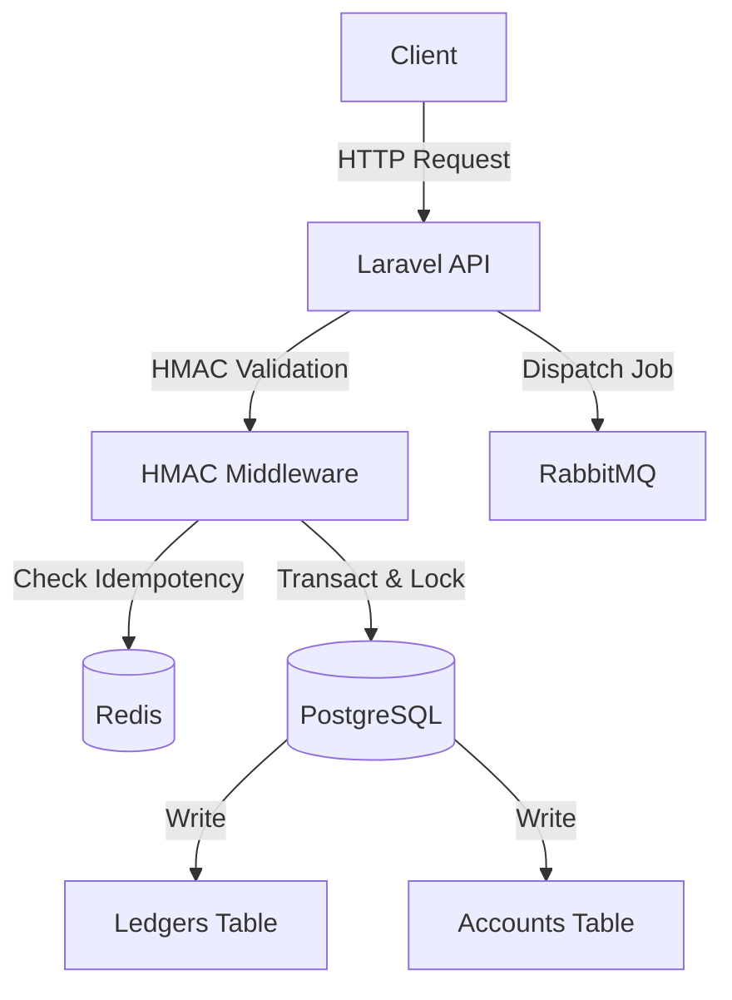

# SentinelPay Architecture

This document provides a high-level overview of the SentinelPay payment system architecture.

## System Overview

SentinelPay is a high-availability distributed payment API designed for financial integrity and transaction race-condition prevention.

### Core Components
- **Laravel 12 API**: The main application interface serving RESTful endpoints.
- **PostgreSQL**: The primary relational database enforcing ACID compliance and housing the immutable ledger.
- **Redis**: In-memory data store used specifically for fast-path idempotency caching.
- **RabbitMQ**: Message broker utilized for dispatching asynchronous post-transaction jobs (e.g., webhook notifications).

## Concurrency Control

SentinelPay uses **Pessimistic Row-Level Locking** to eliminate race conditions, double-spending, and deadlocks.

1. **Deadlock Prevention**: When transferring funds between Account A and Account B, the system consistently sorts the UUIDs in memory before acquiring a database lock. This ensures lock acquisition order is deterministic.
2. **`SELECT ... FOR UPDATE`**: The `Account` rows are locked exclusively for the duration of the database transaction. Concurrent requests attempting to mutate the same accounts will block until the active transaction completes or rolls back.

## Idempotency Mechanism

To protect against network retries causing duplicate charges, SentinelPay implements a strict idempotency mechanism backed by Redis:

1. **Fast-path via Redis**: Every transfer request involves an `idempotency_key`. The API checks Redis for this key. If found, the previously committed transaction is returned immediately without touching the PostgreSQL database.
2. **Database constraints**: A unique index on `idempotency_key` exists in the `transactions` table.
3. **TOCTOU Protection**: If two identical requests simultaneously bypass the Redis cache, PostgreSQL's `UNIQUE` constraint will force one transaction to fail. The exception is caught and correctly handled to prevent 500 errors, gracefully returning the winner's committed transaction.

## Immutable Ledger

Financial transactions require a strictly append-only audit trail. This is enforced at two layers:
1. **Application Layer**: Overridden `update()` and `delete()` methods on the `Ledger` Eloquent model throw a `RuntimeException`.
2. **Database Layer**: PostgreSQL triggers enforce `BEFORE UPDATE` and `BEFORE DELETE` to raise an exception, preventing DBA errors or direct SQL mutations.
