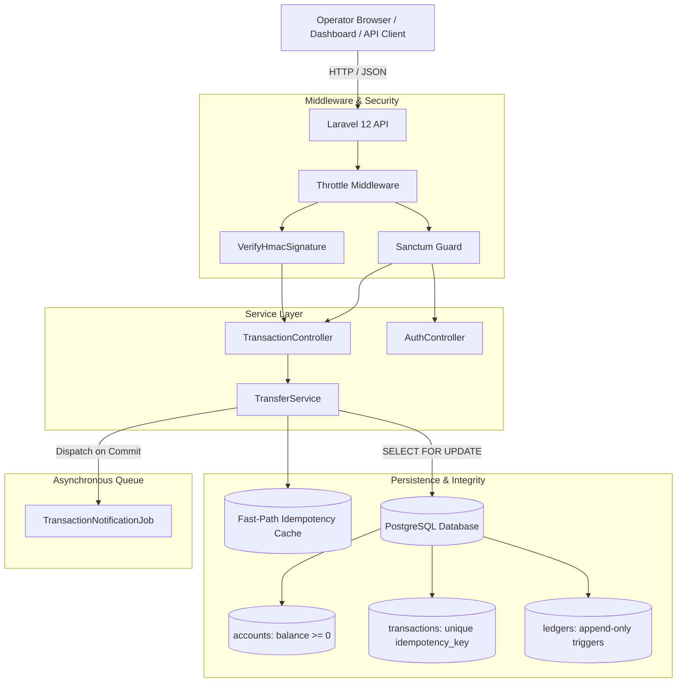

# SentinelPay Architecture & Engineering Design

This document details the system architecture, concurrency control models, database integrity triggers, and security mechanisms of SentinelPay.

## 1. System Overview

SentinelPay is a high-availability, security-oriented financial payment platform designed to prevent double-spending, race conditions, payload tampering, and ledger manipulation.

### Technology Stack
- **API Framework**: Laravel 12 on PHP 8.2+
- **Relational Database**: PostgreSQL (ACID compliant with CHECK constraints & PL/pgSQL triggers)
- **Token Authentication**: Laravel Sanctum with UUID morph support
- **Payload Verification**: HMAC-SHA256 with timing-safe constant-time evaluation
- **Caching**: File/Array cache for local development; Redis for multi-node deployments
- **Message Pipeline**: Decoupled async job architecture (`TransactionNotificationJob`)
- **Operations Console**: Vanilla ES module dashboard engine with Dark Liquid Glass Fintech design system


```mermaid
graph TD
    Client[Operator Browser / Dashboard / API Client] -->|HTTP / JSON| WebServer[Laravel 12 API]

    subgraph Middleware & Security
        WebServer --> RateLimiter[Throttle Middleware]
        RateLimiter --> HmacCheck[VerifyHmacSignature]
        RateLimiter --> SanctumAuth[Sanctum Guard]
    end

    subgraph Service Layer
        HmacCheck --> TxController[TransactionController]
        SanctumAuth --> TxController
        SanctumAuth --> AuthController[AuthController]
        TxController --> TransferService[TransferService]
    end

    subgraph Persistence & Integrity
        TransferService --> Cache[(Fast-Path Idempotency Cache)]
        TransferService -->|SELECT FOR UPDATE| PG[(PostgreSQL Database)]
        PG --> Accounts[(accounts: balance >= 0)]
        PG --> Transactions[(transactions: unique idempotency_key)]
        PG --> Ledgers[(ledgers: append-only triggers)]
    end

    subgraph Asynchronous Queue
        TransferService -->|Dispatch on Commit| Queue[TransactionNotificationJob]
    end
```

---

## 2. Concurrency Control & Race Prevention

SentinelPay uses **Pessimistic Row-Level Locking** to completely eliminate race conditions and double-spending.

### Deadlock-Free UUID Ordering
When transferring funds between `sender` and `receiver`, concurrent requests moving in opposing directions (e.g., Alice $\rightarrow$ Bob and Bob $\rightarrow$ Alice) could deadlock if locks are acquired in arbitrary order. SentinelPay resolves this by sorting account UUIDs alphabetically before executing the database lock:

```php
$lockIds = [$senderAccountId, $receiverAccountId];
sort($lockIds);

$accounts = Account::whereIn('id', $lockIds)
    ->lockForUpdate()
    ->get()
    ->keyBy('id');
```

The `SELECT ... FOR UPDATE` query establishes an exclusive row lock on both accounts. Any competing thread attempting to modify either account blocks until the current transaction commits or rolls back.

---

## 3. Multi-Tier Idempotency & Conflict Resolution

To protect against network retries causing duplicate debits, SentinelPay implements strict idempotency backed by PostgreSQL:

1. **Fast-Path Cache**: The API first inspects the cache for the given `idempotency_key`. If present and the payload matches, the existing transaction is returned without touching the database.
2. **PostgreSQL Source of Truth**: The `transactions` table enforces a database-level `UNIQUE (idempotency_key)` constraint.
3. **Canonical Payload Fingerprinting**: To prevent silent reuse of an idempotency key with conflicting parameters (e.g. altering amount or recipient), `TransferService` computes a SHA-256 hash over canonical normalized fields (`amount`, `currency`, `sender_id`, `receiver_id`). Mismatched fingerprints throw `IdempotencyConflictException` and return `HTTP 409 Conflict`.
4. **TOCTOU Race Handling**: If concurrent requests arrive simultaneously before cache warming occurs, PostgreSQL's unique constraint causes the duplicate to throw `UniqueConstraintViolationException`. SentinelPay intercepts this error, re-fetches the committed winner's transaction, validates the fingerprint, and gracefully returns the record without surfacing 500 errors.

---

## 4. Immutable Append-Only Ledger

Financial integrity mandates that ledger records can never be mutated or erased. SentinelPay enforces this at two architectural layers:

1. **Eloquent Model Guard (`app/Models/Ledger.php`)**:
   `update()` and `delete()` methods throw `RuntimeException` on any attempt to modify ledger records via the application.
2. **Database Trigger Guard (`ledgers` table)**:
   A PL/pgSQL trigger function (`prevent_ledger_mutation()`) is bound to `BEFORE UPDATE` and `BEFORE DELETE` on the `ledgers` table, raising a PostgreSQL database exception if raw SQL or direct DBA updates are attempted.
